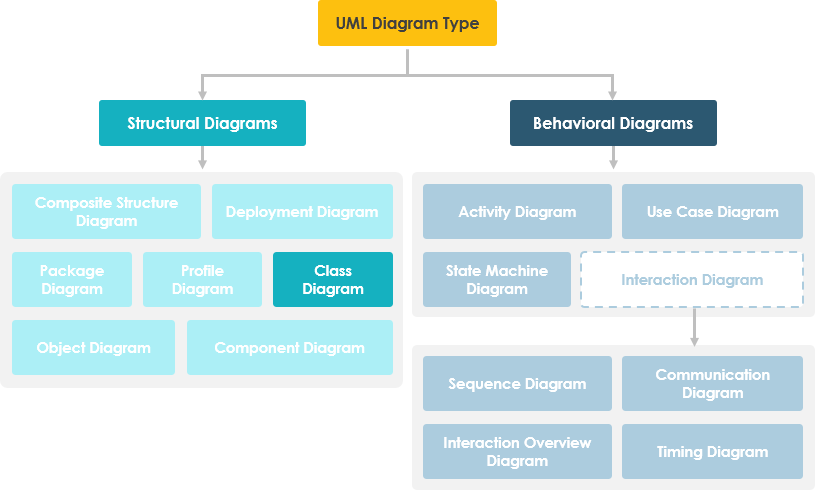
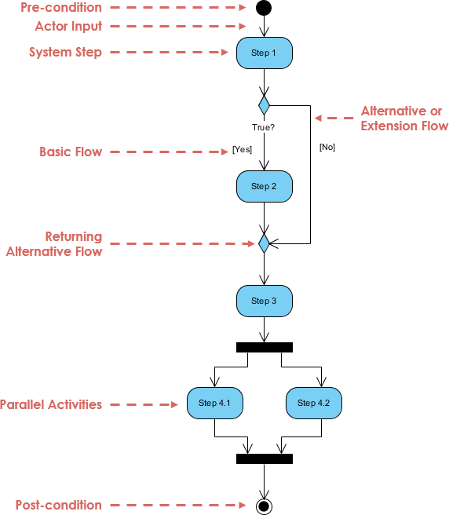
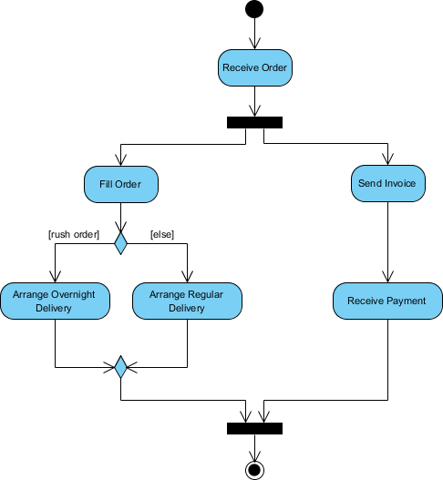
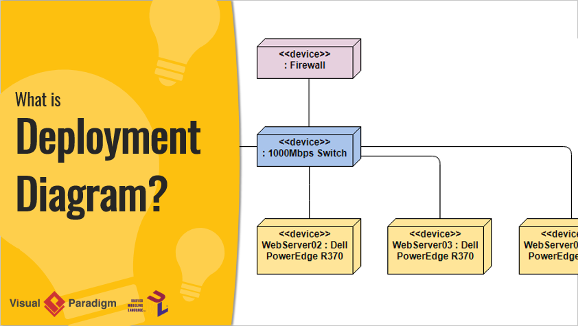
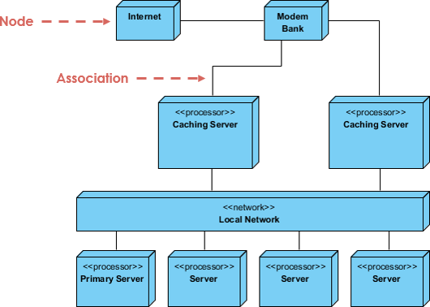
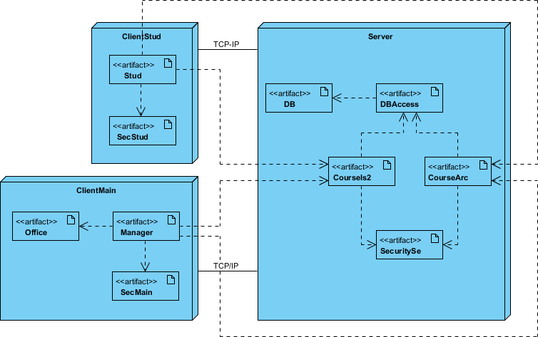

# CheckPoint 13

---
## ¿Cuáles son las partes de un diagrama de clases? Responde que es, para que sirve, ejemplo de utilización e imágenes y explicación de lo que me estás mostrando 

En ingeniería de software, un diagrama de clases en el lenguaje de modelado unificado (UML) es un tipo de diagrama de estructura estática que describe la estructura de un sistema mostrando las clases del sistema, sus atributos, operaciones (o métodos) y las relaciones entre los objetos.

### Propósito de los diagramas de clases

1. Muestra la estructura estática de los clasificadores en un sistema
2. El diagrama proporciona una notación básica para otros diagramas de estructura prescritos por UML
3. También es útil para desarrolladores y otros miembros del equipo
4. Los analistas de negocios pueden usar diagramas de clases para modelar sistemas desde una perspectiva empresarial

Un diagrama de clases UML se compone de:

- Un conjunto de clases y
- Un conjunto de relaciones entre clases

### ¿Qué es una clase?

Descripción de un grupo de objetos que desempeñan funciones similares en el sistema y que consta de:

- Las características estructurales (atributos) definen lo que los objetos de la clase "saben"
  - Representan el estado de un objeto de la clase
  - Son descripciones de las características estructurales o estáticas de una clase
- Las características de comportamiento (operaciones) definen lo que los objetos de la clase "pueden hacer"
  - Definen la forma en que los objetos pueden interactuar
  - Las operaciones son descripciones de las características de comportamiento o dinámicas de una clase

### Notación de clase

Una notación de clase consta de tres partes:

1. Nombre de clase
    - El nombre de la clase aparece en la primera partición.
2. Atributos de clase
    - Los atributos se muestran en la segunda partición.
    - El tipo de atributo se muestra después de los dos puntos.
    - Los atributos se asignan a las variables miembro (miembros de datos) en el código.
3. Operaciones de clase (métodos)
    - Las operaciones se muestran en la tercera partición. Son servicios que proporciona la clase.
    - El tipo de retorno de un método se muestra después de los dos puntos al final de la firma del método.
    - El tipo de retorno de los parámetros del método se muestra después de los dos puntos después del nombre del parámetro.
    - Las operaciones se asignan a los métodos de clase en el código

La representación gráfica de la clase MyClass como se muestra arriba:

- MyClass tiene 3 atributos y 3 operaciones
- El parámetro p3 de op2 es de tipo int
- op2 devuelve un float
- op3 devuelve un puntero (indicado por un *) a Class6

### Relaciones de clase

Una clase puede estar involucrada en una o más relaciones con otras clases. Una relación puede ser de uno de los siguientes tipos: (Consulte la figura de la derecha para ver la representación gráfica de las relaciones).

#### Tipo de relación

##### Herencia (o generalización):

- Representa una relación "es-un".
- El nombre de una clase abstracta se muestra en cursiva.
- SubClass1 y SubClass2 son especializaciones de SuperClass.
- Una línea sólida con una punta de flecha hueca que apunta desde la clase secundaria a la clase principal.

##### Asociación simple:

- Un vínculo estructural entre dos clases iguales.
- Existe una asociación entre la Clase 1 y la Clase 2.
- Una línea continua que conecta dos clases.

##### Agregación:

Un tipo especial de asociación. Representa una relación de "parte de".

- La clase 2 es parte de la clase 1.
- Muchas instancias (indicadas por el *) de la clase 2 se pueden asociar con la clase 1.
- Los objetos de la clase 1 y la clase 2 tienen tiempos de vida separados.
- Una línea sólida con un rombo sin relleno en el extremo de la asociación conectada a la clase de compuesto

##### Composición:

Un tipo especial de agregación en el que las partes se destruyen cuando se destruye el todo.

- Los objetos de la clase 2 viven y mueren con la clase 1.
- La clase 2 no puede sostenerse por sí sola.
- Una línea sólida con un diamante relleno en la asociación conectada a la clase de compuesto

##### Dependencia:

- Existe entre dos clases si los cambios en la definición de una pueden causar cambios en la otra (pero no al revés).
- La ​​clase 1 depende de la clase 2
- Una línea discontinua con una flecha abierta

#### Nombres de relaciones

- Los nombres de las relaciones se escriben en el medio de la línea de asociación.
- Los buenos nombres de las relaciones tienen sentido cuando se leen en voz alta:
    - "Cada hoja de cálculo contiene una cierta cantidad de celdas",
    - "una expresión se evalúa como un valor".
- A menudo tienen una pequeña punta de flecha para indicar en qué dirección se debe leer la relación, por ejemplo, las expresiones se evalúan como valores, pero los valores no se evalúan como expresiones.

#### Relación - Roles

- Un rol es un propósito direccional de una asociación.
- Los roles se escriben al final de una línea de asociación y describen el propósito que cumple esa clase en la relación.
    - Por ejemplo, una celda está relacionada con una expresión. La naturaleza de la relación es que la expresión es la fórmula de la celda.

#### Navegabilidad

Las flechas indican si, dada una instancia que participa en una relación, es posible determinar las instancias de la otra clase que están relacionadas con ella.

El diagrama anterior sugiere que,

- Dada una hoja de cálculo, podemos localizar todas las celdas que contiene, pero que
    - no podemos determinar a partir de una celda en qué hoja de cálculo se encuentra.
- Dada una celda, podemos obtener la expresión y el valor relacionados, pero
    - dado un valor (o expresión) no podemos encontrar la celda de la que son atributos.

#### Visibilidad de los atributos y operaciones de clase

En el diseño orientado a objetos, existe una notación de visibilidad para los atributos y operaciones. UML identifica cuatro tipos de visibilidad: pública, protegida, privada y de paquete.

Los símbolos +, -, # y ~ antes de un nombre de atributo y operación en una clase indican la visibilidad del atributo y la operación.

- \+ indica operaciones o atributos públicos
- \- indica operaciones o atributos privados
- \# indica operaciones o atributos protegidos
- \~ indica operaciones o atributos de paquete

### Ejemplo de visibilidad de clase

En el ejemplo anterior:

- attribute1 y op1 de MyClassName son públicos.
- attribute3 y op3 están protegidos.
- attribute2 y op2 son privados.

### Multiplicidad

¿Cuántos objetos de cada clase participan en las relaciones? La multiplicidad se puede expresar como:

- Exactamente uno - 1
- Cero o uno - 0..1
- Muchos - 0..* o *
- Uno o más - 1..*
- Número exacto - p. ej. 3..4 o 6
- O una relación compleja - p. ej. 0..1, 3..4, 6.* significaría cualquier número de objetos que no sea 2 o 5

### Ejemplo de multiplicidad

- Requisito: Un estudiante puede tomar muchos cursos y muchos estudiantes pueden estar inscritos en un curso.
- En el siguiente ejemplo, el diagrama de clases (a la izquierda) describe la declaración del requisito anterior para el modelo estático, mientras que el diagrama de objetos (a la derecha) muestra la instantánea (una instancia del diagrama de clases) de la inscripción en los cursos de Ingeniería de software y Gestión de bases de datos respectivamente.

### Ejemplo de agregación: computadora y sus partes

- Una agregación es un caso especial de asociación que denota una jerarquía de "compuestos por" elementos.
- El agregado es la clase padre, los componentes son las clases hijas.

### Ejemplo de herencia: taxonomía de celdas

- La herencia es otro caso especial de asociación que denota una especie de jerarquía
- La herencia simplifica el modelo de análisis al introducir una taxonomía
- Las clases secundarias heredan los atributos y operaciones de la clase principal.

### Diagrama de clases: ejemplo de herramienta de diagrama

Un diagrama de clases también puede tener notas adjuntas a las clases o relaciones. Las notas se muestran en gris.

En el ejemplo anterior:

Podemos interpretar el significado del diagrama de clases anterior leyendo los puntos de la siguiente manera.

1. Shape es una clase abstracta. Se muestra en cursiva.
2. Shape es una superclase. Circle, Rectangle y Polygon se derivan de Shape. En otras palabras, un Circle es una Shape. Esta es una relación de generalización/herencia.
3. Hay una asociación entre DialogBox y DataController.
4. Shape es parte de Window. Esta es una relación de agregación. Shape puede existir sin Window.
5. Point es parte de Circle. Esta es una relación de composición. Point no puede existir sin un Circle.
6. Window depende de Event. Sin embargo, Event no depende de Window.
7. Los atributos de Circle son radius y center. Esta es una clase de entidad.
8. Los nombres de los métodos de Circle son area(), circum(), setCenter() y setRadius().
9. El parámetro radius en Circle es un parámetro in de tipo float.
10. El método area() de la clase Circle devuelve un valor de tipo double.
11. Los atributos y nombres de los métodos de Rectangle están ocultos. Algunas otras clases en el diagrama también tienen sus atributos y nombres de métodos ocultos.

### Cómo trabajar con sistemas complejos: ¿diagramas de clases múltiples o de una sola clase?

Inevitablemente, si está modelando un sistema grande o una gran área de negocios, habrá numerosas entidades que deberá considerar. ¿Deberíamos usar un diagrama de clases múltiple o de una sola clase para modelar el problema? La respuesta es:

- En lugar de modelar cada entidad y sus relaciones en un solo diagrama de clases, es mejor usar diagramas de clases múltiples.
- Dividir un sistema en diagramas de clases múltiples hace que el sistema sea más fácil de entender, especialmente si cada diagrama es una representación gráfica de una parte específica del sistema.

### Perspectivas del diagrama de clases en el ciclo de vida del desarrollo de software

Podemos utilizar diagramas de clases en diferentes fases de desarrollo de un ciclo de vida de desarrollo de software y, por lo general, modelando diagramas de clases en tres perspectivas diferentes (niveles de detalle) progresivamente a medida que avanzamos:

Perspectiva conceptual: los diagramas se interpretan como una descripción de cosas en el mundo real. Por lo tanto, si se adopta la perspectiva conceptual, se dibuja un diagrama que representa los conceptos en el dominio en estudio. Estos conceptos se relacionarán naturalmente con las clases que los implementan. La perspectiva conceptual se considera independiente del lenguaje.

Perspectiva de especificación: los diagramas se interpretan como una descripción de abstracciones o componentes de software con especificaciones e interfaces, pero sin compromiso con una implementación particular. Por lo tanto, si se adopta la perspectiva de especificación, estamos viendo las interfaces del software, no la implementación.

Perspectiva de implementación: los diagramas se interpretan como una descripción de implementaciones de software en una tecnología y un lenguaje en particular. Por lo tanto, si se adopta la perspectiva de implementación, estamos viendo la implementación del software.

---
## ¿Los diagramas de implementación son estructurales o de comportamiento? Justifica tu respuesta

UML es un acrónimo de Unified Modeling Language y, como sabemos, es un lenguaje de modelado estandarizado que consta de un conjunto integrado de diagramas diseñados para ayudar a los desarrolladores de sistemas y software a definir, visualizar, construir y documentar artefactos de sistemas de software y, por ejemplo, para el modelado de negocios.

UML es un conjunto de mejores prácticas de ingeniería que han demostrado ser efectivas en el modelado de sistemas grandes y complejos y es una parte muy importante del desarrollo de software orientado a objetos.

UML utiliza principalmente notación gráfica para expresar el diseño de proyectos de software. El uso de UML ayuda a los equipos de proyecto a comunicarse, explorar diseños potenciales y validar diseños arquitectónicos de software.

### Origen de UML

El objetivo de UML es proporcionar una notación estándar que pueda ser utilizada por todos los métodos orientados a objetos y seleccionar e integrar los mejores elementos de sus notaciones predecesoras. UML fue desarrollado para una amplia gama de aplicaciones. En consecuencia, proporciona construcciones para una amplia gama de sistemas y actividades (por ejemplo, sistemas distribuidos, análisis, diseño e implementación de sistemas).

### ¿Por qué UML?

A medida que el valor estratégico del software ha aumentado para muchas empresas, la industria ha buscado métodos para automatizar la producción de software, así como para mejorar la calidad y reducir los costos y el tiempo de comercialización.

Estas técnicas incluyen tecnología de componentes, programación visual, patrones y estructuras.

Las empresas también están buscando métodos para gestionar la complejidad de los sistemas a medida que crecen.

En particular, reconocen la necesidad de abordar problemas arquitectónicos recurrentes, como la distribución física, la concurrencia, la replicación, la seguridad, el equilibrio de carga y la tolerancia a fallos.

Además, si bien el desarrollo web facilita algunas cosas, generalmente empeora estos problemas arquitectónicos.

El Lenguaje Unificado de Modelado (UML) fue desarrollado para satisfacer estas necesidades.

Los principales objetivos del diseño UML son:

- Proporcione a los usuarios un lenguaje de modelado visual expresivo y listo para usar para que puedan desarrollar y compartir modelos significativos.
- Proporcionar mecanismos de extensibilidad y especialización para ampliar los conceptos básicos.
- Ser independiente de lenguajes de programación y procesos de desarrollo específicos.
- Proporcionar una base formal para comprender un lenguaje de modelado.
- Fomentar el crecimiento del mercado de herramientas orientadas a objetos.
- Admite conceptos de desarrollo de alto nivel, como colaboración, estructuras, patrones y componentes.
- Integrar las mejores prácticas.

Los diagramas UML se dividen en dos tipos: diagramas de estructura y diagramas de comportamiento.

Los diagramas de estructura muestran la estructura estática de un sistema y sus partes en diferentes niveles de abstracción e implementación, así como sus relaciones. Los elementos de un diagrama de estructura representan conceptos significativos del sistema y pueden incluir conceptos abstractos, del mundo real y de implementación. Hay siete tipos de diagramas de estructura:

- Diagrama de estructura compuesta
- Diagrama de implementación
- Diagrama de paquete
- Diagrama de perfil
- Diagrama de clase
- Diagrama de objetos
- Diagrama de componentes

Los diagramas de comportamiento muestran el comportamiento dinámico de los objetos en un sistema, que puede describirse como una serie de cambios en el sistema a lo largo del tiempo. Los diagramas de comportamiento incluyen:

- Diagrama de actividad
- Use el diagrama del caso
- Diagrama de estado
- Diagrama de secuencia
- Diagrama de comunicación
- Diagrama general de interacción
- Diagrama de tiempo

### Diagrama de implementación

Un diagrama de implementación ayuda a modelar el aspecto físico de un sistema de software orientado a objetos. Este es un diagrama de bloques que muestra la arquitectura del sistema como la implementación (distribución) de artefactos de software.

Los artefactos son elementos concretos del mundo físico que son el resultado de un proceso de desarrollo.

El diagrama modela la configuración del tiempo de ejecución en una representación estática y visualiza la distribución de artefactos en la aplicación.

En la mayoría de los casos, esto implica modelar configuraciones de hardware junto con los componentes de software que las albergan.

En el contexto de UML, un diagrama de implementación es parte de la familia de diagramas de estructura porque describe un aspecto del sistema en sí, es decir, la implementación física de la información producida por un programa en los componentes de hardware.

---
## ¿Qué es un diagrama de actividades? Responde que es, para que sirve, ejemplo de utilización e imágenes y explicación de lo que me estás mostrando

El diagrama de actividades es otro diagrama de comportamiento importante en el diagrama UML para describir los aspectos dinámicos del sistema. El diagrama de actividades es esencialmente una versión avanzada del diagrama de flujo que modela el flujo de una actividad a otra.

### Cuándo utilizar un diagrama de actividades

Los diagramas de actividades describen cómo se coordinan las actividades para proporcionar un servicio, lo que puede estar en diferentes niveles de abstracción. Por lo general, se necesita lograr un evento mediante algunas operaciones, en particular cuando la operación tiene como objetivo lograr una serie de cosas diferentes que requieren coordinación, o cómo se relacionan entre sí los eventos en un solo caso de uso, en particular, los casos de uso donde las actividades pueden superponerse y requerir coordinación. También es adecuado para modelar cómo se coordina una colección de casos de uso para representar flujos de trabajo comerciales

1. Identificar casos de uso candidatos, mediante el examen de flujos de trabajo comerciales
2. Identificar condiciones previas y posteriores (el contexto) para casos de uso
3. Modelar flujos de trabajo entre/dentro de casos de uso
4. Modelar flujos de trabajo complejos en operaciones sobre objetos
5. Modelar en detalle actividades complejas en un diagrama de actividades de alto nivel

### Diagrama de actividades: aprenda con ejemplos

Un diagrama de actividades básico, como un diagrama de flujo,

#### Diagrama de actividades: modelado de un procesador de textos

El siguiente ejemplo de diagrama de actividades describe el flujo de trabajo de un procesador de textos para crear un documento mediante los siguientes pasos:

- Abra el paquete de procesamiento de textos.
- Cree un archivo.
- Guarde el archivo con un nombre único dentro de su directorio.
- Escriba el documento.
- Si necesita gráficos, abra el paquete de gráficos, créelos y péguelos en el documento.
- Si necesita una hoja de cálculo, abra el paquete de hojas de cálculo, créela y péguela en el documento.
- Guarde el archivo.
- Imprima una copia impresa del documento.
- Salga del paquete de procesamiento de textos.

#### Ejemplo de diagrama de actividades: procesar un pedido

Dada la descripción del problema relacionado con el flujo de trabajo para procesar un pedido, modelemos la descripción en una representación visual mediante un diagrama de actividades:

El siguiente ejemplo de diagrama de actividad visualiza el flujo en forma gráfica.

#### Ejemplo de diagrama de actividades: inscripción de estudiantes

Este ejemplo de diagrama de actividades UML describe un proceso para la inscripción de estudiantes en una universidad de la siguiente manera:

- Un solicitante desea inscribirse en la universidad.
- El solicitante entrega una copia completa del formulario de inscripción.
- El registrador inspecciona los formularios.
- El registrador determina que los formularios se hayan completado correctamente.
- El registrador informa al estudiante que debe asistir a una presentación general de la universidad.
- El registrador ayuda al estudiante a inscribirse en seminarios.
- El registrador le pide al estudiante que pague la matrícula inicial.

#### Diagrama de actividades - Swimlane

Un swimlane es una forma de agrupar actividades realizadas por el mismo actor en un diagrama de actividades o diagrama de actividades o de agrupar actividades en un solo hilo. A continuación, se muestra un ejemplo de un diagrama de actividades Swimlane para modelar la presentación de gastos del personal:

#### Diagrama de actividades con y sin carriles

El siguiente ejemplo de diagrama de actividades describe el proceso empresarial para reunirse con un nuevo cliente utilizando un diagrama de actividades sin carriles.

La siguiente figura describe el proceso comercial para reunirse con un nuevo cliente utilizando un diagrama de actividades con Swimlane.

### Resumen de la notación del diagrama de actividades

Actividad: Se utiliza para representar un conjunto de acciones.

Acción: Una tarea a realizar

Flujo de control: Muestra la secuencia de ejecución

Flujo de objetos: Muestra el flujo de un objeto desde una actividad (o acción) a otra actividad (o acción).

Nodo inicial: Representa el comienzo de un conjunto de acciones o actividades

Nodo final de actividad: Detener todos los flujos de control y flujos de objetos en una actividad (o acción)

Nodo de objeto: Representa un objeto que está conectado a un conjunto de flujos de objetos

Nodo de decisión: Representa una condición de prueba para garantizar que el flujo de control o el flujo de objetos solo recorra una ruta

Nodo de fusión: Reúna de nuevo las distintas rutas de decisión que se crearon mediante un nodo de decisión.

Nodo de bifurcación: Dividir el comportamiento en un conjunto de flujos de actividades (o acciones) paralelos o simultáneos

Unir nodo: Reúna un conjunto de flujos de actividades (o acciones) paralelos o simultáneos.

Carriles y particiones: Una forma de agrupar actividades realizadas por el mismo actor en un diagrama de actividades o de agrupar actividades en un único hilo

---
## ¿De qué manera el diseño del sistema ayuda al proceso de desarrollo? Justifica tu respuesta, busca en todo lo que puede ayudar al proceso de desarrollo

Muchos programadores, ante una tarea difícil, descuidan la etapa de diseño, citando el hecho de que el diseño es una pérdida de tiempo y, en este caso, solo me interferirá.

A menudo, esta afirmación resulta cierta si la tarea es realmente pequeña y las calificaciones del programador son suficientes para determinar la solución más óptima.

Los programadores que no utilizan UML se dividen en varios grupos:

- Empezaré a escribir código y en el proceso entenderé qué y cómo;
- Leo foros, habr, medium, stack overflow, un libro, publicaciones en las paredes, carteles desde arriba...;
- Preguntaré a mis compañeros, tal vez alguien sepa cómo solucionar un problema similar;
- Empezaré a dibujar cuadrados y mostraré esquemáticamente qué visión de la tarea se ha formado en mi mente.

Pero para problemas más complejos, la planificación anticipada y la simulación facilitan mucho la programación. Además, es más fácil realizar cambios en los diagramas de clases que en el código fuente.

Se puede establecer una analogía con la construcción de una casa. Cuando alguien quiere construir una casa, no se limita a golpear el martillo y ponerse a trabajar. Necesita tener un plan (un plan de diseño) para poder analizar y modificar su sistema.

Si ya ha comenzado a describir su tarea en papel, esto ya es una gran ventaja.

### Pros y contras del diseño UML

Desventajas:

- pérdida de tiempo;
- la necesidad de conocer varios diagramas y sus notaciones.

Ventajas:

- la oportunidad de mirar un problema desde diferentes puntos de vista;
- es más fácil para otros programadores comprender la esencia de la tarea y cómo implementarla;
- Los diagramas son relativamente fáciles de leer una vez que se familiariza con su sintaxis lo suficientemente rápido.

---
## ¿Por qué usaríamos un diagrama de implementación? Responde que es, para que sirve, ejemplo de utilización e imágenes y explicación de lo que me estás mostrando

A UML deployment diagram is a diagram that shows the configuration of run time processing nodes and the components that live on them. Deployment diagrams is a kind of structure diagram used in modeling the physical aspects of an object-oriented system. They are often be used to model the static deployment view of a system (topology of the hardware). 

### Cuándo utilizar un diagrama de implementación

- ¿Con qué sistemas existentes deberá interactuar o integrarse el sistema recién agregado?
- ¿Qué tan robusto debe ser el sistema (por ejemplo, hardware redundante en caso de una falla del sistema)?
- ¿Qué y quién se conectará o interactuará con el sistema, y ​​cómo lo hará?
- ¿Qué middleware, incluido el sistema operativo y los enfoques y protocolos de comunicación, utilizará el sistema?
- ¿Con qué hardware y software interactuarán directamente los usuarios (PC, computadoras de red, navegadores, etc.)?
- ¿Cómo monitoreará el sistema una vez implementado?
- ¿Qué tan seguro debe ser el sistema (necesita un firewall, hardware físicamente seguro, etc.)?

### Propósito de los diagramas de implementación

- Muestran la estructura del sistema en tiempo de ejecución
- Capturan el hardware que se utilizará para implementar el sistema y los vínculos entre los diferentes elementos de hardware
- Modelan los elementos físicos del hardware y las rutas de comunicación entre ellos
- Se pueden utilizar para planificar la arquitectura de un sistema
- También son útiles para documentar la implementación de componentes o nodos de software

### Diagrama de implementación de un vistazo

Los diagramas de implementación son importantes para visualizar, especificar y documentar sistemas integrados, cliente/servidor y distribuidos, y también para administrar sistemas ejecutables a través de ingeniería directa e inversa.

Un diagrama de implementación es simplemente un tipo especial de diagrama de clases, que se centra en los nodos de un sistema. Gráficamente, un diagrama de implementación es una colección de vértices y arcos. Los diagramas de implementación suelen contener:

#### Nodos

- El cuadro 3D representa un nodo, ya sea de software o de hardware
- El nodo HW se puede representar con <<stereotype>>
- Las conexiones entre nodos se representan con una línea, con <<stereotype>> opcional
- Los nodos pueden residir dentro de un nodo

#### Otras notaciones

- Dependencia
- Relaciones de asociación.
- También puede contener notas y restricciones.

### Pasos para modelar un sistema integrado

1. Identifique los dispositivos y nodos que son exclusivos de su sistema.
2. Proporcione pistas visuales, especialmente para dispositivos inusuales, utilizando los mecanismos de extensibilidad de UML para definir estereotipos específicos del sistema con íconos apropiados. Como mínimo, querrá distinguir procesadores (que contienen componentes de software) y dispositivos (que, en ese nivel de abstracción, no contienen software directamente).
3. Modele las relaciones entre estos procesadores y dispositivos en un diagrama de implementación. De manera similar, especifique la relación entre los componentes en la vista de implementación de su sistema y los nodos en la vista de implementación de su sistema.
4. Si es necesario, amplíe los dispositivos inteligentes modelando su estructura con un diagrama de implementación más detallado.

### Pasos para modelar un sistema cliente/servidor

1. Identifique los nodos que representan los procesadores cliente y servidor de su sistema.
2. Resalte los dispositivos que son relevantes para el comportamiento de su sistema. Por ejemplo, querrá modelar dispositivos especiales, como lectores de tarjetas de crédito, lectores de credenciales y dispositivos de visualización que no sean monitores, porque su ubicación en la topología de hardware del sistema probablemente sea arquitectónicamente significativa.
3. Proporcione pistas visuales para estos procesadores y dispositivos mediante estereotipos.
4. Modele la topología de estos nodos en un diagrama de implementación. De manera similar, especifique la relación entre los componentes en la vista de implementación de su sistema y los nodos en la vista de implementación de su sistema.

El ejemplo muestra la topología de un sistema de recursos humanos, que sigue una arquitectura clásica cliente/servidor.

#### Ejemplo de cliente/servidor TCP/IP

#### Ejemplo de diagrama de implementación: modelado de un sistema distribuido

1. Identifique los dispositivos y procesadores del sistema como si se tratara de sistemas cliente/servidor más simples.
2. Si necesita razonar sobre el rendimiento de la red del sistema o el impacto de los cambios en la red, asegúrese de modelar estos dispositivos de comunicación con el nivel de detalle suficiente para realizar estas evaluaciones.
3. Preste mucha atención a las agrupaciones lógicas de nodos, que puede especificar mediante el uso de paquetes.
4. Modele estos dispositivos y procesadores mediante diagramas de implementación. Siempre que sea posible, utilice herramientas que descubran la topología de su sistema al recorrer la red de su sistema.
5. Si necesita centrarse en la dinámica de su sistema, introduzca diagramas de casos de uso para especificar los tipos de comportamiento que le interesan y amplíe estos casos de uso con diagramas de interacción.
6. Al modelar un sistema completamente distribuido, es común materializar la red en sí misma como un nodo, es decir, Internet, LAN, WAN como nodos.

El ejemplo muestra la topología de un sistema completamente distribuido.

#### Ejemplo de diagrama de implementación: sistema distribuido corporativo

### Lista de verificación para la planificación de la implementación

Cuando esté redactando un plan de implementación para su empresa, es posible que no sepa por dónde empezar o en qué debería centrarse. La siguiente lista de verificación puede brindarle algunas ideas para planificar la implementación:

- ¿Cómo se instalará su sistema?
    1. ¿Quién lo instalará? ¿Cuánto tiempo debería llevar la instalación?
    2. ¿Dónde puede fallar la instalación?
    3. ¿Cómo puede dar marcha atrás si la instalación falla? ¿Cuánto tiempo lleva dar marcha atrás?
    4. ¿Cuál es su ventana de instalación (durante qué período de tiempo puede instalar su sistema)?    
    5. ¿Qué copias de seguridad necesita antes de la instalación?
    6. ¿Necesita hacer una conversión de datos?
    7. ¿Cómo sabe que la instalación fue exitosa?
- Si diferentes versiones del sistema estarán en producción al mismo tiempo, ¿cómo resolverá las diferencias?
- ¿En qué sitios físicos necesita implementar y en qué orden?
    1. ¿Cómo capacitará a su personal de soporte y operaciones?
    2. ¿Necesita implementar un sistema de soporte de producción para que el personal de soporte use su propio entorno para simular problemas?

- ¿Cómo capacitará a sus usuarios?
    1. ¿Qué documentación, en qué formatos e idiomas, necesitan sus usuarios y su personal de soporte y operaciones?
    2. ¿Cómo se implementarán las actualizaciones de la documentación?
